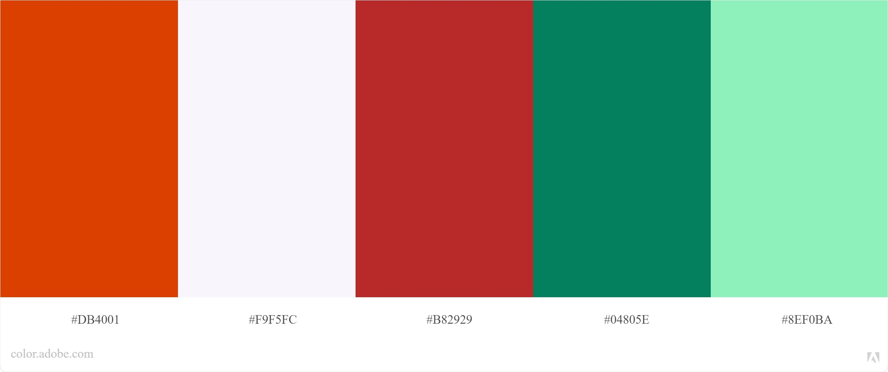

# Eric Brown's Web Dev I: About Me Project

 

---

## **Table of Contents**

- [Description](#description)

- [Color Scheme](#colorscheme)

- [Changes to Nav Bar in Final Draft](#navbar-changes)

- [Citations](#citations)

- [License Information](#license)

---

## **Description**

This website is a personal website I have created as my final project for my Web Development I class at Raritan Valley Community College in Branchburg, New Jersey. As part of each week's assignment, I have added the following content to the site:

### **Adding HTML, Images and Links**

- Here, I learned how to create a new HTML document, the file structure of a web page and some helpful shortcuts in VS code, such as the Emmet shortcuts to generate basic HTML boilerplate code, which I use any time I create a new webpage. I also learned how to add images to a webpage, including an avatar and a stand-in for a logo I would create later in the course.

 

### **Initial Setup on Github and Netlify**

- I learned how to use essential features of Github such as editing my profile, creating repositories and setting up Git in VS Code. I also learned how to host a site on Netlify from a Github repository.

 

### **Adding Some Style**

- During this assignment, I learned the basics of CSS, and I was able to practice by adding colors, fonts, text and box styling.

 

### **Tell Me More**

- Here, I added a hobbies section, a photo gallery to the page. - In the **Hobbies** section, I mostly focused on experimenting with some more advanced CSS parameters such as gradients, box shadows and link hover effects.

  - In the **Gallery** section, I learned how to properly size and align images, and I was able to make the gallery somewhat responsive with some simple box model-related CSS properties.
  - Upon revisiting the **Gallery** section for the final draft of the project, I changed the static figure captions I had used initially to an image hover effect with a simple fade-in animation in order to make the section look neater and conserve screen space. I also cropped the first photo **(img\penannular-brooch-640w.jpg)** , as the original photo I had used was 640px wide, as called for in the assignment instructions, but it was taken as a portrait, meaning the aspect ratio of the photo was different. The newly cropped version has the same proportions as the other two photos in the gallery.

  - In the **Article** section, I learned how to create an article layout using text columns, as well as how to use CSS pseudo selectors to create a dropcap that modifies the first character of every paragraph.
    - For the final draft of the project, I removed the columns of text, and instead used figures and flexbox to structure the screenshots, code snippets and SVG images that I included.

 

### **Responsive Design**

- Here, I learned how to use media queries to make my webpage responsive on a tablet and a laptop or large tablet. I also was able to practice with Flexbox and Grid properties to alter the ways that several sections display based on screen size.

 

### **Embedded Media**

- Here, I learned how to embed a video from Youtube as well as how to resize the video frame while maintaining aspect ratio.

 

### **Web Forms**

- In the **Contact Form** section, I learned how to create a contact form with several different types of input, such as text, dropdowns and radio buttons. I also styled a submit button with a simple inset/outset effect on click based on the interface design principles we went over during the previous week. Additionally, I learned how to use Netlify as a simple backend for my website so that data submitted through the contact form would appear on my Netlify dashboard.

 

### **Nav Bar**

- Here, I learned how to create a simple navigation bar for my website, which allows users to navigate to specific sections of the page based on the section's ID.

---

## **Color Scheme**

I made a lot of changes to the color scheme as I worked on the project. My initial color scheme technically passed Adobe Color's accessibility tests and looked decent enough through Chromelens, but in practice, I found the colors were very difficult to use together in a way that I found visually appealing, and I found myself needing to choose between style and readability too often to be comfortable using my original color scheme for my final draft. For the final version of my site, I chose to generate a new color palette using Adobe color with better contrast. My final color palette includes the following:

** Color 1:**

- RGB: `rgb(219, 64, 1)`
- Hex: `#DB4001`

** Color 2:**

- RGB: `rgb(249, 245, 252)`
- Hex: `#F9F5FC`

** Color 3:**

- RGB: `rgb(184, 41, 41)`
- Hex: `#B82929`

** Color 4:**

- RGB: `rgb(4, 128, 94)`
- Hex: `#04805E`

** Color 5:**

- RGB: `rgb(142, 240, 186)`
- Hex: `#8EF0BA`

---

## **Changes to Navbar in Final Draft: Hamburger Menu and Fixed Navbar in Mobile State**

For the final draft of the project, I added an animated hamburger-style dropdown menu to the nav bar in order to conserve space at mobile screen sizes. The animation was based off of [this](https://www.youtube.com/watch?v=DZg6UfS5zYg) tutorial by Traversy Media, but I made adjustments in order to reduce the number of non-semantic elements used and make the menu fit my site's aesthetic and structure.

In particular, changing the positioning to fit my desired navbar structure was difficult, as the hamburger menu was used as a minimalist navigation menu for all media states in the tutorial and was always in the same absolute position on the page. In order to work the hamburger icon into my navigation menu, I used a &lt;label> element with display:flex; in order to center it vertically and push it to the far right side of the navbar. After doing this, the hamburger icon fit neatly into the navbar's grid layout. Finally, I added a simple animation to the nav menu in order to make its appearance seem less sudden when it is opened with the hamburger icon.

As I built the website, I noticed that the page was very long on mobile, and a user who wants to navigate to another section would either need to hunt for it by scrolling or scroll back to the top to reach the navbar. To make navigation easier on mobile devices, I set the navbar's position to fixed while in mobile view in order to give mobile users quick access to navigation functions and reduce the need for repetitive scrolling.

---

## **Citations**

### **Navbar Hamburger Menu Tutorial:**

[Traversy Media: Pure CSS Hamburger Menu & Overlay](https://www.youtube.com/watch?v=DZg6UfS5zYg)

> Brad Traversy

> Traversy Media

> Youtube

> Published on Apr 4, 2019

  

### **Hobbies Section Background Image:**

[Motherboard, Reverse Detail](https://unsplash.com/photos/aQYgUYwnCsM)

> Michael Dziedzic

> [@lazycreekimages](https://unsplash.com/@lazycreekimages)

> Tyler, TX, USA

> Published on February 1, 2020

> Free to use under the Unsplash License

 

### **Sources used in Lit/Article Section: "Animated Svg Images Using CSS" Blog:**

[Dev Ed: Learn To Build An SVG Animation With CSS](https://www.youtube.com/watch?v=gWai7fYp9PY&t=3s)

> Dev Ed's Channel on Youtube

> Youtube

> Published on Nov 23, 2019

 

[Animate SVG with CSS](https://blog.logrocket.com/animating-svg-with-css-83e8e27d739c/)

> Hope Armstrong

> Logrocket

> Published January 8, 2019

 

[Raster vs Vector](https://vector-conversions.com/vectorizing/raster_vs_vector.html)

> Gomez Graphics/Vector Conversions:

 

[Rustacean-orig-noshadow.svg](https://commons.wikimedia.org/wiki/File:Rustacean-orig-noshadow.svg)

> Karen Rustad Tölva

> Originally from [rustacean.net](https://rustacean.net/) (Apparently defunct or otherwise offline at the time of writing.)

> This file is made available under the [Creative Commons CC0 1.0 Universal Public Domain Dedication.](https://creativecommons.org/publicdomain/zero/1.0/deed.en)

---

## **License Information**

 

This work is licensed under a <a rel="license" href="http://creativecommons.org/licenses/by/4.0/">Creative Commons Attribution 4.0 International License</a>

[Full license terms](https://creativecommons.org/licenses/by/4.0/legalcode)
